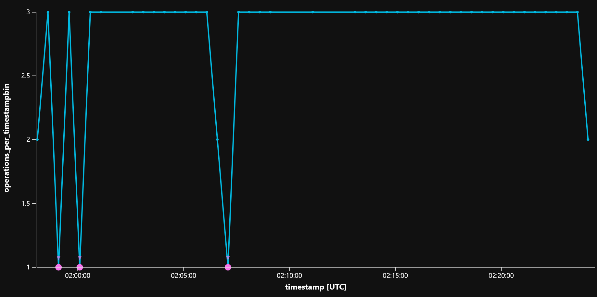

# Examining the scaling behavior of the CosmosDB Trigger for Azure Functions

## Overview

This document will examine a scaling problem with performing long running executions in response to changes in CosmosDB when using the CosmosDB trigger. It will also provide an alternative solution to the problem using an intermediate queue to distribute work more evenly across available hosts.
The sample code used to illustrate the issue is provided in this repo, along with a script to deploy all the environmental dependencies.

## Getting started with the sample code

Clone this repo to your local machine and open this directory in powershell. You can deploy resources such as a CosmosDB account, Storage accounts and a function app for your app using the CreateAzureDependencies.ps1 PowerShell script. Edit the file to change the names of resources that needs to be unique. After deploying these resources, copy the local.settings.json file that it created in this directory to the CosmosDBTriggerScalingSample subdirectory. Open the function app in that directory in Visual Studio (using the .sln file) or VS Code. You can run this function app locally or deploy it to the function app that the script creates for you. The script will create a function app on a consumption plan. You can use other app service plans for further experimentation. To start a run, send a request to the LoadGenerator_HttpStart function. Results are written to an Azure Storage table named `processingresults` in the provided storage account, and telemetry is sent to App Insights. Either can be used to analyze performance.

## Limitations in scaling out the Functions hosts for CosmosDB triggers

The Azure Functions CosmosDB trigger uses the [CosmosDB Changefeed processor library](https://docs.microsoft.com/en-us/azure/cosmos-db/change-feed-processor) to poll changes in a CosmosDB collection. It uses a lease collection to track which changes have been processed. The Changefeed processor can only create one lease per partition range. A partition range maps to a physical partition in CosmosDB. The CosmosDB engine is designed to minimize the number of physical partitions. The allocation of physical partitions is obscured from the user. It depends on factors that include the RU allocation, amount of data, and the actual physical hardware the engine is deployed to. This means that the number of physical partitions can increase or decrease for your collection at any time.
The Changefeed processor, and by extension the Functions CosmosDB trigger, can only scale out to as many hosts as there are partition ranges and therefore physical partitions. If you have functions that take longer to process changes than the interval in which they're made, and the number of physical partitions are too low to enable sufficient scaling out of the processing, a backlog will develop.

## Example

We have a CosmosDB collection with one partition range. An Azure Function writes two new documents to it every 10 seconds. A second Azure Function reads changes from that collection using a CosmosDB trigger. It then performs processing on it that takes 30 seconds of full cpu time. The function will be triggered with two documents to be processed at first. After 60 seconds, it will complete execution. During this time, 10 more documents have been created. The function will now be triggered with these 10 documents, which will take 300 seconds to process. During this time the backlog of changes will grow to 60 documents. Clearly the backlog is growing, and one would expect the function to scale accordingly. Because it is limited to the number of partitions, this does not happen. Our function continues to execute on a single host. It is important to note at this point that we also have to set a limit on the number of documents to collect on a trigger. This is important to prevent timeouts. The default timeout is 300 seconds. Trying to process more than 10 documents at a time will cause our function to be terminated by the host, discarding all the documents, and failing to update the lease. This can cause an infinte loop, as all future triggers will be timed out before updating the lease, resulting in the same documents being sent to the trigger. In this example we limited the maximum number of documents to 9 to prevent timeouts, while accounting for overhead.
The example is executed on a consumption plan, allowing it to scale out as necessary.

You can see from the following graph that the duration (the time between a record being created and being processed) trends constant across the duration of time when using a CosmosDB trigger. Operations are grouped in 1 minute bins. This run generated data for 10 minutes. Processing the last document occurred around 48 minutes after it was created. We also display the name of the host in the graph. You'll notice that there are two hosts, due to a host restart. The data follows behind each other, indicating that the two hosts did not execute simultaneously.


[App Insights Query](#Operation-count-by-duration-per-host)

## Workaround using an intermediate queue

The sample  also contains a second function with a CosmosDB trigger, which uses an output binding to write the id of the document to a storage queue, instead of processing it. Another function is then triggered using a queue trigger, and uses an input binding to load the document from CosmosDB, before performing the same processing on it. In this setup we double the amount of reads to CosmosDB, but the storage queue trigger is able to scale out to meet the demand load. We can add the data to the previous graph:


[App Insights Query](#Operation-count-by-duration-per-processor)

If we map the Queue processor function to hosts, we see that the load was split across three hosts:


[App Insights Query](#Operation-count-by-timestamp-per-host)

The caveat to this approach is that changes are not guaranteed to be processed in order.

## Scaling up using Premium functions

With the release of Azure Premium Functions, we can now use more powerful hosts on a consumption-type plan. These hosts offer more processing cores for our apps, which makes it worth exploring multi-threading. Whilst writing multi-threaded functions can be very hard in some languages, this sample was written in .Net. By adding the [AsyncEnumerator](https://github.com/Dasync/AsyncEnumerable) nuget package we can easily parallelize the work in the CosmosDBChangeProcessor:

```c#
await input.ParallelForEachAsync( async doc =>
{
    await ProcessDocument(DeserializeDocument(doc), tableOutput, log, nameof(CosmosDbChangeProcessor));
});
```

We can see that performance has been improved significantly. The longest duration is now 12 minutes. 50% of operations are processed in 8 minutes or less.


[App Insights Query](#Operation-count-by-duration-for-cosmosdbchangeprocessor)

As the individual operations are CPU bound, we can see that around 3 operations are processed at a time. 117 of operations fall into the 3 operations per timestamp bin. The hosts that this function is deployed on has access to 4 cores. The .Net framework and functions runtime would need one core to process overhead and other functions, distributing work to the other three.


[App Insights Query](#CosmosDBChangeProcessor_operations_per_timestamp_bin)

If the work being performed is not cpu bound, performance improves significantly again. The longest operations now only take 7 minutes, and 74 operations (58%) take 4 minutes or less.


[App Insights Query](#Operation-count-by-duration-for-cosmosdbchangeprocessor)

## Conclusion

The CosmosDB trigger for Azure Functions is a useful tool for processing changes to data in CosmosDB, but should not be used to directly process changes that result in long-running queries, due to it's scaling-out characteristics. A good workaround is to use an intermediate queue to schedule changes to be processed. When using a storage queue, the order in which changes will be processed will be lost, but this can be remedied by using an Azure Storage Bus queue.

## Appendix - App insights queries

### Operation count by duration per host

```kusto
traces
| where customDimensions.prop__RunId == "485e3c45-5b79-43da-8242-74aa718b8bec" 
| where message startswith "Processed"
| where operation_Name == "CosmosDBChangeProcessor" 
| extend duration = bin(totimespan(customDimensions.prop__ProcessingDuration), 1m) / 1m
| summarize operationcount = count() by duration, cloud_RoleInstance
| order by duration asc nulls last 
| render timechart 
```

### Operation count by duration per processor

```kusto
traces
| where customDimensions.prop__RunId == "485e3c45-5b79-43da-8242-74aa718b8bec" 
| where message startswith "Processed"
| extend duration = bin(totimespan(customDimensions.prop__ProcessingDuration), 1m) / 1m
| summarize operationcount = count() by duration, operation_Name
| order by duration asc nulls last 
| render timechart 
```

### Operation count by timestamp per host

```kusto
traces
| where customDimensions.prop__RunId == "485e3c45-5b79-43da-8242-74aa718b8bec" 
| where message startswith "Processed"
| where operation_Name == "QueueProcessor" 
| summarize operationcount = count() by bin(timestamp, 1m), cloud_RoleInstance
| order by timestamp asc nulls last 
| render timechart 
```

### Operation count by duration for cosmosdbchangeprocessor

```kusto
traces
| where customDimensions.prop__RunId == "e8eb0753-dffb-42fe-beba-1fbf6294d6e9" 
| where message startswith "Processed"
| where operation_Name == "CosmosDBChangeProcessor"
| extend duration = bin(totimespan(customDimensions.prop__ProcessingDuration), 1m) / 1m
| summarize operationcount = count() by duration, operation_Name
| order by duration asc nulls last 
| render timechart 
```

### CosmosDBChangeProcessor operations per timestamp bin

```kusto
traces
| where customDimensions.prop__RunId == "e8eb0753-dffb-42fe-beba-1fbf6294d6e9" 
| where message startswith "Processed"
| where operation_Name == "CosmosDBChangeProcessor"
| extend timefinished = bin(timestamp, 30s)
| summarize operations_per_timestampbin = count(timestamp) by bin(timestamp, 30s) 
| render timechart 
```